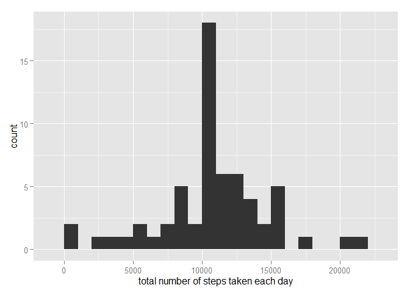

# Reproducible Research: Peer Assessment 1


###Loading and preprocessing the data


```r
unzip( zipfile = "activity.zip" )

file <- read.csv( "activity.csv" )
```


### What is mean total number of steps taken per day?

1. Calculate the total number of steps taken per day


```r
library( ggplot2 )

numberSteps <- tapply( file$steps, file$date, sum, na.rm = TRUE )

qplot( numberSteps, binwidth = 1000,
       xlab = "total number of steps taken each day",
       geom = "histogram" )
```

 

2. Calculate and report the mean and median


```r
mean( numberSteps, na.rm = TRUE )
```

```
## [1] 9354.23
```

```r
median( numberSteps, na.rm = TRUE )
```

```
## [1] 10395
```


### What is the average daily activity pattern?

1.Make a time series plot of the 5-minute interval (x-axis) and the average number of steps taken, averaged across all days (y-axis)


```r
library( ggplot2 )

averages <- aggregate ( x = list( steps = file$steps ),
						by = list( interval = file$interval ),
						FUN = mean, na.rm = TRUE )
					  
ggplot( data = averages, aes( x = interval, y = steps ) ) +
		geom_line( ) +	xlab( "5-minute interval" ) +
		ylab( "average number of steps taken" )
```

 

2. Which 5-minute interval, on average across all the days in the dataset, contains the maximum number of steps?


```r
averages[ which.max( averages$steps ), ]
```

```
##     interval    steps
## 104      835 206.1698
```

### Imputing missing values

1. There are many days/intervals where there are missing values (coded as `NA`). The presence of missing days may introduce bias into some calculations or summaries of the data.


```r
missValues <- is.na( file$steps )

table( missValues )
```

```
## missValues
## FALSE  TRUE 
## 15264  2304
```


2. The mean value for that 5-minute interval used to fill the missing values.


```r
# Function used to replace missing values with the mean values

replaceValue <- function( steps, interval )
{
    value <- NA
    
    if ( !is.na( steps ) )
    {
        
        value <- c( steps )
        
    }
    else
    {
        
        value <- ( averages[ averages$interval == interval, "steps" ] )
        
    }
    
    return( value )
    
}
```

3. Create new dataset


```r
editData <- file

editData$steps <- mapply( replaceValue, editData$steps, editData$interval )
```

4. Make a histogram of the total number of steps taken each day and Calculate and report the mean and median total number of steps taken per day.


```r
numberSteps <- tapply( editData$steps, editData$date, FUN=sum )

qplot( numberSteps, binwidth = 1000,
       xlab = "total number of steps taken each day",
       geom = "histogram" )
```

 

```r
mean( numberSteps )
```

```
## [1] 10766.19
```

```r
median( numberSteps )
```

```
## [1] 10766.19
```

- *Do these values differ from the estimates from the first part of the assignment?*

A: Yes, mean and median values are higher after imputing missing data because in the original data, there are some days with *steps* values *NA* for 
any *interval*.

- *What is the impact of imputing missing data on the estimates of the total daily number of steps?*

A: By default, the total number of steps taken in such days are set to 0s and after replacing missing *steps values* with the mean these 0 values are removed from the histogram of total number of steps taken each day.

#### Are there differences in activity patterns between weekdays and weekends?

1. Create a new factor variable in the dataset with two levels - "weekday" and "weekend".


```r
newFactor <- function( date )
{
    weekDays <- c( "segunda-feira", "terça-feira",
                   "quarta-feira", "quinta-feira",
                   "sexta-feira" )
    
    weekEnd <- c("sábado", "domingo")
    
    day <- weekdays( date )
    
    if ( day %in% weekDays )
    {
        
        return("weekday")
        
    }
    else if ( day %in% weekEnd )
        {
            
            return("weekend")
            
        }
    else
    {
        
        stop("invalid date")
        
    }
}

editData$date <- as.Date( editData$date )

editData$day <- sapply( editData$date, FUN = newFactor )
```

2. Create the panel plot.


```r
averages <- aggregate( steps ~ interval + day, data = editData, mean)

ggplot( averages, aes( interval, steps ) ) +
        geom_line( ) + facet_grid( day ~ . ) +
        xlab( "5-minute interval" ) + ylab("Number of steps" )
```

 
